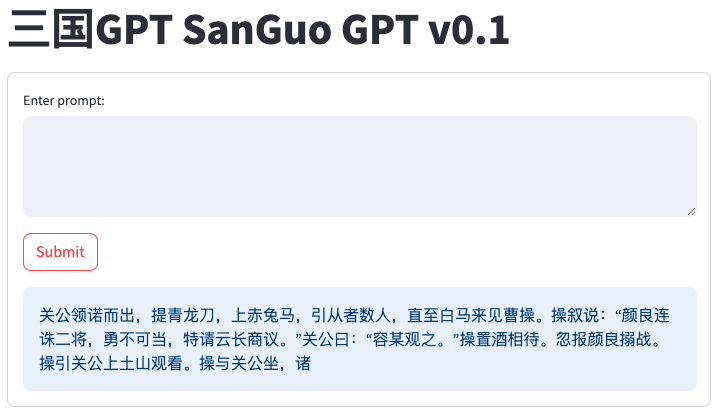
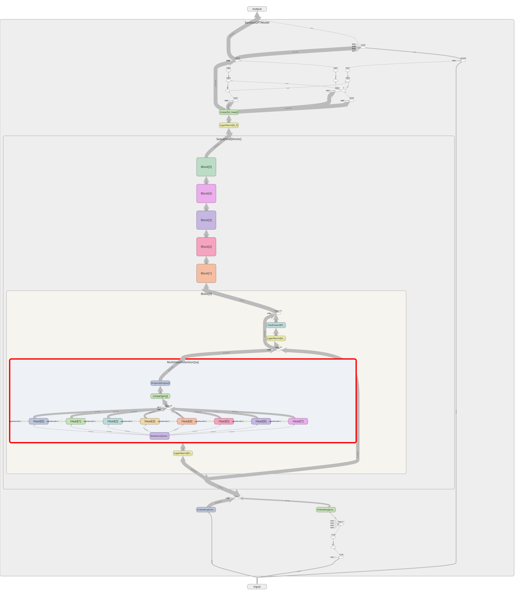
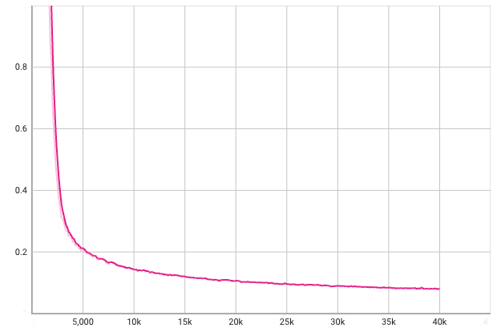
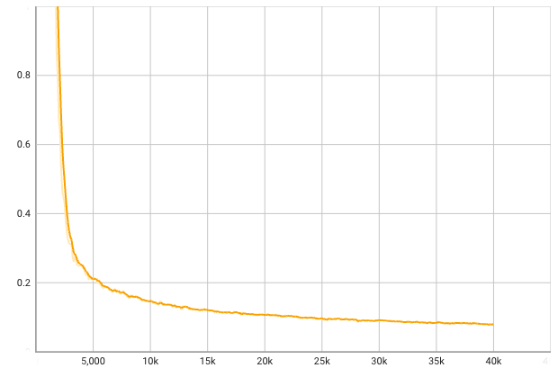

# 三国GPT (SanGuo GPT) v0.1

## Overview

SanGuo GPT is a Large Language Model trained on 三国演义 (San1 Guo2 Yan3 Yi4, Romance of the Three Kindoms), an ancient Chinese novel based on historical events happened ~1800 years ago during the late Han dynasty. It is a Transformer-based model with about 13.778M parameters in current version.

I created this project for learning and exploration purpose.
- I'd like to try out the LLM application building process end-to-end, including major steps like data ingestion & preprocessing, shuffling/sampling, model building & training, visualization, model checkpointing and model serving.
- I want to explore the idea of "书读千遍，其义自现" (something like "if you read a book a thousand times, the meaning and implications will emerge by itself"). This idea popped up when I chat with a friend, and I found it very interesting. What if I train the model with data from just one book and iterate many steps? How would the model behave after intensive training on a single book? 

I also plan to use this project as a vehicle for playing with other new ideas - stay tuned!

---

A little background about 三国演义 (Romance of the Three Kindoms)...

It is one of the "four prominent classics" of ancient Chinese literature, and is so influential that I believe almost every Chinese know some quotes from it.
It's also one of the favorite inspirations for 穿越小说 ("time travel fictions"), in which main character changed significant events such as the death of 关羽 (Guan Yu).
I've read a quite few good ones. :-)

Illustration of a famous scene 长坂坡 (Chang Ban Po), from http://www.mfcb.net/16035.html:


Picture link: http://media.mfcb.net/wp-content/uploads/2020/05/sanguo61-24cbp001.jpg

## Quickstart

Install prerequisites (assuming you are using conda, pip steps are similar):

```bash
conda install pytorch torchvision -c pytorch
conda install matplotlib tensorboard
conda install jupyter
conda install streamlit
conda activate base
# to resolve the "no module streamlit.cli" error
pip install --upgrade streamlit
```

You may also want to install TensorFlow as TensorBoard might miss some features without it.

Prepare the dataset:

```bash
./prepare_data.sh
```

Train the model:
```bash
python train.py --num_iters 5000 \
    --eval_interval 100 --eval_iters 10 \
    --batch_size 32 --block_size 256 --dropout 0.01 \
    -o sanguogpt.pth
```

Serving the model with Web UI:
```bash
streamlit run generate.py -- --model sanguogpt.pth -l 100 --webui
```

Here is an example of the UI:



## Dataset

The text of 三国演义 is widely available. The one I used is from this repo:
https://github.com/naosense/Yiya.git

To download the raw text file:
```bash
wget https://raw.githubusercontent.com/naosense/Yiya/master/book/%E4%B8%89%E5%9B%BD%E6%BC%94%E4%B9%89.txt -O sanguo.txt
```

## Preprocessing

The raw text is GBK (or GB2312?) encoded, so I had to convert it to UTF-8 for Python. This can be done using the `iconv` tool.

```bash
iconv -f GBK -t UTF-8 sanguo.txt > sanguo-utf8.txt
```

Remove the irrelevant contents from the text (e.g. seperators between chapters):

```bash
sed -i '/^=/,/^=/d' sanguo-utf8.txt
```

Or if using Mac:
```bash
sed -i "" '/^=/,/^=/d' sanguo-utf8.txt
```

I've included downloading and preprocessing steps in the `prepare_data.sh` script.

## Tokenization

Each Chinease character in the text is regarded as a token, so I don't use a tokenizer in this project. IMHO, a Chinese character is not a "letter" - it's more like a word or subword. Therefore, each Chinese character should be treated as a token.

## Shuffling & Sampling

Each training example is a sequence of tokens, so it can be represented using its starting position in the source text.

E.g. if the source text has 60,000 tokens and the block size is 200, then every training example must start from a position between 0 and 59799 (inclusive). We can use each example's start position to represent it. So the entire dataset can be represented as a collection of starting positions (numbers from 0 to 59799).

When generating the datasets for training and validation, I don't actually store sequences in these datasets. Instead I just store their representations (starting positions). This saves me lots of memory in shuffling and sampling.

Just like regular ML jobs, I need to split the dataset into training and validation.
I first generate a random permutation of start positions (0, 1, 2, ..., 59799), then assign the first 90% of the resulting list to be the training set and rest being the validation set. The ratio 90% is a hyperparameter that can be tuned by command line argument. In this way, both training set and validation set are randomly shuffled and there won't be any duplicates between the two sets.

## The Model

Instead of calling the existing libraries, this version used Transformer blocks that were purely hand written.
Model implementation was based on Andrej Karpathy's ["Building a GPT"](https://colab.research.google.com/drive/1JMLa53HDuA-i7ZBmqV7ZnA3c_fvtXnx-?usp=sharing) notebook, with some modifications/customizations.

In this version, my model has 13.778M parameters. It's a typical GPT model with 6 identical Transformer blocks, each having 8 attention heads. I used internal dimension of 384 and block size of 256. Batch size of 32 was used in training. All hyperparameters are tunable using command line arguments. 

Here is a visualization of the model architecture using TensorBoard.



## Training

The training loop is fairly straightforward. In each step, I generate a batch of examples, feed them into the model and optimize the parameters using SGD.

I trained the model with 40000 iterations (steps). What does it mean? Let's do a simple math.

- The source text has 606051 tokens in total.
- Assuming `block_size` is 256, the entire dataset (containing all examples) will have `606051-256=605795` examples.
- Assuming 90% are training set, then the training set will contain 545215 examples.
- `batch_size` is 32, then we'll need about 17038 iterations (steps) to go through the training set once.
- So a training loop of 40000 iterations means about 2.35 epochs. Or in other words, the model will read the whole book about 2.35 times.

Apparently this is far from "reading the book a thousand times", but since this is just the first version I decided to give it a try.

## Visualization

I used TensorBoard to visualize the training process.

Training loss over steps:



Validation loss over steps:



Both training and validation losses are below 0.1 after 40000 steps.

## Generating & Serving

The script `generate.py` supports both command line and Web App mode.
By default it runs in command line mode, for example:

```bash
python generate.py -m <model_checkpoint> -l 100 --prompt '<your_prompt>'
```

The drawback is that you'll need to specify the prompt (Chinese characters) from the command line.

I used [streamlit](https://github.com/streamlit/streamlit) to build a simple Web App for serving the model.

To run the script in Web UI mode, just add the `--webui` argument and run it with streamlit.

```bash
streamlit run generate.py -- --model <model_checkpoint> -l 100 --webui
```

## Future Works

Lots of stuff I'm thinking about! Just to name a few:

- Try the more optimized Transformer blocks
- Use DataLoader from PyTorch
- Build a larger model
- Visualize the embeddings
- Split the text into chapters, so that the model can generate "end of chapter" instead of specifying a max length.
- Generate text in a streaming way to improve responsiveness.
- Optimize the inference part to speed up generation.
- ...

## Contact

Interested in discussion? Just connect with me and let's chat!